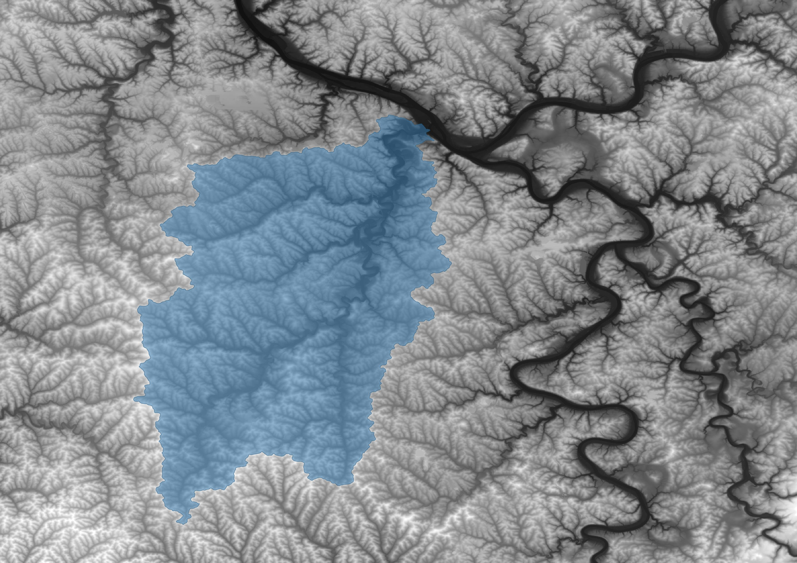

**CEES 351: Water Resources Engineering**  
**Duquesne University**  

```{r include=FALSE}
library(ggplot2)
library(raster)
library(rgdal)
library(dplyr)
library(broom)
```

## 1. Water $\nu \delta \omega \rho$  
What is hydrology?
Hydrology is, quite literally, the study of water.  The word stems from the Greek words of water and study.  Water is a unique substance on Earth.  We have all observed how water expands as it freezes, but there are many ways that water is unique.  

### 1.1 Fluid properties
Water has a number of unique properties (Dingman, 3rd: Section 1.5).  Most people recognize that water expands slightly when it freezes as one of the most interesting (Dingman, 3rd: Figure 1.7).  

There are other important properties of water, some of which we will use in this class are (values are given at 10°C unless otherwise noted):  
- High surface tension ($\sigma = 0.074201 N/m$)  
- Low viscosity ($\mu = 0.001307 \frac{N s}{m^2}$, $\nu=1.4 \times 10^{-6} \frac{m^2}{s}$)  
- High heat capacity ($c_p=4191 \frac{J}{kg K}$)  
- High heat of vaporization ($L_e = 2.471 \times 10^6 \frac{J}{kg}$)  
- High solvent capacity; water is often called the universal solvent.  

Most of these properties are due to the hydrogen bonds that give water its stickiness.  

### 1.2 Dimensionless numbers  
It is convenient to use dimensionless numbers to compare fluid flow and mechanisms that dictate fluid flow.  Dimensionless numbers come from a mathematical tool called dimensional analysis.  The central concept in dimensional analysis is the Buckingham Pi Theorem, which says that for a system of m variables that are written with n dimensions, the number of unique dimensionless numbers that describe the system is given by $p=m-n$.  

One example of this is the comparison of turbulent versus viscous flow.  We identify the following variables:  

|Variable|Dimensions|Description|
|---|---|---|
|L|[L]|representative length scale|
|U|$\frac{[L]}{[T]}$|representative velocity scale|
|$\rho$|$\frac{[M]}{[L]^3}$|density of the fluid|
|$\mu$|$\frac{[M]}{[T] [L]}$|dynamic viscosity of the fluid|  

This gives us four variables with three (Length, Time, and Mass) dimensions.  By the Buckingham Pi Theorem, there is one unique dimensionless number that describes such a system.  This one happens to be the most famous number in fluid mechanics, Reynolds Number:  
\begin{equation}
\mathrm{Re} = \frac{\rho U L}{\mu} = \frac{U L}{\nu}
\end{equation}

It can be observed that the dynamic viscosity divided by the density gives the kinematic viscosity, which is used above.  

Another example of dimensional analysis is the Bond Number, which considers capillary forces.  In the analysis of capillary forces, these are usually balanced by gravity.  We identify the following variables:  

|Variable|Dimensions|Description|
|---|---|---|
|L|[L]|representative length scale|
|$\sigma$|$\frac{[M]}{[T]^2}$|surface tension|
|$\rho$|$\frac{[M]}{[L]^3}$|density of the fluid|
|g|$\frac{[L]}{[T]^2}$|acceleration due to gravity|  

Again, only one unique dimensionless number can be formed, the Bond Number:  
\begin{equation}
\mathrm{Bo} = \frac{\rho g L^2}{\sigma}
\end{equation}

## 2. The Hydrologic Cycle  


The water on the surface, with two exceptions, is the same water that has been around since Earth began (with only some violations in laboratories).  The two natural exceptions are water being dragged down to the mantle in submarine subduction zones and in volcanic eruptions.  Once example of a “violation” of this rule is electrolysis of water, which produces hydrogen gas.  Of course, there are many ways in which human activity dramatically alters the water cycle.  


This updated water cycle (USGS) features many of the alterations of flow.  Specifically in this class, we will consider changes in evaporation and precipitation by climate change, alterations of surface flow due to land cover changes, and changes in groundwater due to abstraction.  

## 3. Water Reserviors  
The water, on the surface of the Earth, is split between fresh and salt water, frozen and liquid, ground, surface, and biological, and within surface, lakes, wetlands, and rivers.  

  

### 3.1 Water Balance  
\begin{equation}
\mathrm{Inflow} - \mathrm{Outflow} = \Delta \mathrm{Storage} = P-G_{out}+G_{in}+Q_{in}-Q_{out}-ET=\Delta S \approx 0
\end{equation}

In a control volume, where precipitation, $P$, groundwater flow, e.g., a losing or gaining stream, $G$ if it is along the border of the control volume, surface water flow, $Q$, where the subscripts in and out are relative to the control volume, total net evapotranspiration, $ET$, and storage, $\Delta S$, which is usually taken as zero, but depends on your control volume.  A net, long term deficit could indicate the degradation of a resource.  There are also smaller-scale applications of the control volume and water balance.  Sometimes these are a watershed, but sometimes the control volume is a river fetch or single lake.  This method will work as long as you apply the control volume carefully, and account for storage changes or use a period that allows storage changes to be zero, $\Delta S = 0$.  

We can use the water balance to estimate parameters of our system.  The selection of our system is very important, as not all systems will contain the same inputs and outputs (at least of similar magnitudes).  One standard system is the river basin (that is, one that drains to the ocean).  In general, such a system has an input of precipitation (snow, rain, etc.) and outputs of evapotranspiration (defined below) and river flow into the ocean.  Generally speaking, the groundwater flow will return to the river because of the hydrostatic pressure of the ocean (although this is not a strict rule).  This means that we can measure the evaporation based on the precipitation and river discharge, as was done by [Hobbins et al. (2004)](https://agupubs.onlinelibrary.wiley.com/doi/10.1029/2004GL019846).  

Hobbins, M. T., Ramírez, J. A., & Brown, T. C. (2004). Trends in pan evaporation and actual evapotranspiration across the conterminous U.S.: Paradoxical or complementary? Geophysical Research Letters, 31(13). [https://doi.org/10.1029/2004GL019846](https://agupubs.onlinelibrary.wiley.com/doi/10.1029/2004GL019846)  

### 3.2 Global Water Balance  
Globally, precipitation (P) equals evaporation (E); that is, the amount of water that enters the atmosphere equals the amount of water that leaves the atmosphere on a global scale.  Thus, globally, P=E; however, over land, P=R+E because water can either evaporate or runoff (R) -- typically, or eventually, into the ocean.  

Table 3.2.1  Estimates of world water balance ($\frac{m}{y}$).  From Brutsaert (2005).  

|Reference                    |Land P|Land R|Land E|Ocean P|Ocean E|Global P=E|
|---|---|---|---|---|---|---|
Budyko (1970, 1974)           |0.73  |0.31  |0.42  |1.14   |1.26   |1.02      |
Lvovitch (1970)               |0.73  |0.26  |0.47  |1.14   |1.24   |1.02      |
Lvovitch (1973)               |0.83  |0.29  |0.54  |       |       |          |
Baumgartner and Reichel (1975)|0.75  |0.27  |0.48  |1.07   |1.18   |0.97      |
Korzun et al. (1978)          |0.80  |0.32  |0.49  |1.27   |1.40   |1.13      |

One will notice from Table 1.1 (Brutsaert, 2005), that over land, the precipitation is equal to the sum of runoff and evaporation.  Over the ocean, the evaporation does not simply equal the precipitation plus the runoff rate from the land surface.  This is because of the relative surface area covered by the land versus the ocean.  It is left as an exercise to verify that the difference in precipitation and evaporation over the ocean is accounted for by the land surface runoff.  Global runoff is around 35% to 40%.  

Table 3.2.2 Estimates of different forms of global water storage (depth, m, over Earth’s surface)
From Brutseart (2005)  

|Reference             |Lvovitch (1970) |Baumgartner and Reichel (1975) |Korzun et al. (1978) |  
|----------------------|----------------|-------------------------|---------------------|  
|Oceans                |2686            |2643                     |2624                 |  
|Ice caps and glaciers |47.1            |54.7                     |47.2                 |  
|Total groundwater     |117.6           |15.73                    |45.9                 |  
|Soil water            |0.161           |0.120                    |0.0323               |  
|Lakes                 |0.451           |0.248                    |0.346                |  
|Rivers                |0.00235         |0.00212                  |0.00416              |  
|Atmosphere            |0.0274          |0.0255                   |0.0253               |  

Note that the land surface covers 29% of the surface.  Values in Table 1.3 must be adjusted to reflect the height over their relevant surfaces.  They are given with the normalized area of the entire Earth for comparison purposes.  

Brutsaert, W. (2005). Hydrology (p. 605). Cambridge: Cambridge University Press. [https://doi.org/10.1017/CBO9780511808470](https://doi.org/10.1017/CBO9780511808470)  

Residence time in various water storage bodies can be estimated based on dimensional analysis: the ratio of water storage body to flux. For rivers,  

|Variable     |Value            |  
|---|---|  
|Runoff       |0.30 $m\ y^{-1}$ |
|Land surface |0.29             |
|Storage      |0.003 $m$        |  

\begin{equation}
T_R = \frac{0.003 m}{0.29 \cdot\ 0.30 m\ y^{-1}} \approx\ 0.034 y \approx\ 13 d
\end{equation}  

or 13 days.  

For land-only or ocean-only reservoirs, make sure to adjust the flux so that it is only over the area of interest.  Above, the proportion of Earth that is covered by land, 0.29, is multiplied by the flux of interest, runoff.  

For the atmosphere,

|Variable     |Value            |  
|---|---|  
|Evaporation  |1.02 $m\ y^{-1}$ |  
|Storage      |0.025 $m$        |  

\begin{equation}
T_R = \frac{0.025 m}{1.02 m\ y^{-1}} \approx\ 0.025 y \approx\ 9 d
\end{equation}  

or 9 days.  

### 3.3 US Water Use  

  

Data from: USGS Estimated Water Use in the United States 2010 (Maupin et al., 2014).  Of particular interest is self-supply, which is a domestic water supply that is not a *public water system*.  A public water system is defined as a system that supplies "at least 15 service connections or serves an average of at least 25 people for at least 60 days a year" (EPA, 2024)[https://www.epa.gov/dwreginfo/information-about-public-water-systems]; notably, public systems have no requirement to be public versus private.  The groundwater self-supply represents 14% of the US population.  Since groundwater self-supply represents around 97% of all self-supplied water, this is particularly vulnerable to pollution as there are no testing requirements for self-supply.  

## 4. Watersheds  
The term river- or drainage- basin, watershed, and catchment all refer to a geographic region whose defining quality is that all [surface] water within the boundary will drain through one [surface] outflow.  (Fetter: Section 1.3, Dingman, 3rd: Section 1.7)  

Delineation of a watershed by hand uses a topographic map.  The user first defines the point on the river through which all the water will flow.  From that point, the user traces back along the highest points that border the watershed.  For a review, see the attached:  
- [USDA Guide](https://www.nrcs.usda.gov/Internet/FSE_DOCUMENTS/nrcs144p2_014819.pdf)  
- [West Virginia Guide](http://www.wvca.us/envirothon/pdf/Watershed_Delineation_2.pdf)  

There are computational methods to determine the watershed boundary that are based on digital elevation models (DEM).  One such database is available via web-based platform: [USGS Streamstats](https://streamstats.usgs.gov/ss/), which will also allow you to download a shapefile of your watershed.  Methods for watershed delineation also exist for geographical information systems such as QGIS.  

  

## 5. Energy Budget  
  

The surface net energy (Dingman 3rd edition: Box 6.1, 2nd: equations 7.25 through 7.30, careful of units) is shown in the figure (without the ground energy flux or energy storage) and expressed as:  

\begin{equation}
R_n = R_s (1 - \alpha) + \varepsilon_s R_{ld} - R_{lu}  
\end{equation}  

where $R_n$ is the net radiation at the surface, the subscripts: $s$ indicates solar, thus incoming, $l$ indicates longwave radiation, $u$ is for upward, and $d$ is for downward.  The albedo, or reflectivity of the surface, is $\alpha$.  Some common albedos are:

Typical albedo values (Brutsaert, 2005)  

|Surface                          |Albedo, $\alpha$ |
|---------------------------------|----------|
|Deep water                       |0.04-0.08 |
|Moist, dark soils, plowed fields |0.05-0.15 |
|Gray soils, bare fields          |0.15-0.25 |
|Dry soils, desert                |0.20-0.35 |
|White sand, lime                 |0.30-0.40 |
|Green grass and short vegetation |0.15-0.25 |
|Dry grass                        |0.15-0.20 |
|Dry prairie and savanna          |0.20-0.30 |
|Coniferous forest                |0.10-0.15 |
|Deciduous forest                 |0.15-0.25 |
|Forest with melting snow         |0.20-0.30 |
|Old and dirty snow cover         |0.35-0.65 |
|Clean, stable snow cover         |0.60-0.75 |
|Fress dry snow                   |0.80-0.90 |  

The emissivity is equal to the absorptivity due to the reciprocity theorem (Lorentz/Helmholtz) and is a measurement of how well the downward longwave radiation is absorbed.  

\begin{equation}
R_{lu} = \varepsilon_s \sigma T_s^4  
\end{equation}  

where $\varepsilon_s$ is the emissivity, which is typically close to unity for a near blackbody radiator, $\sigma$ is the Stefan-Boltzmann constant, $\sigma = 5.6697 \times 10^{-8}\ W\ m^{-2}\ K^{-4}$. and $T_s$ is the surface temperature in Kelvin (K).  While usually taken as unity, there is some variation:

Typical Emissivity values (Brutsaert, 2005)  

|Surface             |Emissivity, $\varepsilon$ |
|--------------------|-----------|
|Bare soil (mineral) |0.95-0.97  |
|Bare soil (organic) |0.97-0.98  |
|Grassy vegetation   |0.97-0.98  |
|Tree vegetation     |0.96-0.97  |
|Snow (old)          |0.97       |
|Snow (fresh)        |0.99       |  

\begin{equation}
R_{ld} = \varepsilon_a \sigma T_a^4  
\end{equation}  

where $\varepsilon_a$ is the emissivity of the sky.  This is complicated under cloud cover; although, this is why cloud cover at night can keep the lower atmosphere (where people are) warmer through reflection.  One way to estimate the emissivity of the sky is from the empirical relationship (Mermier and Seguin, 1976; Aase and Idso, 1978):  

\begin{equation}
\varepsilon_a = a\ (\frac{e_a}{T_a})^b  
\end{equation}  

where the constants were found empirically, $a = 1.24$ and $b = 1/7$, $e_a$ is the vapor pressure in hPa (equivalent to mb), and $T$ is in Kelvin.  

Note that albedo, $\alpha$, and therefore the energy budget, is likely to change due to climate change.  This is most evident as highly reflective snow and ice melt to reveal dark and absorbent soil.  The energy budget at the surface is based on the net radiation and controls water flux from the surface and will be developed further for evapotranspiration.  

\begin{equation}
R_{n} = G + H + L_{e}E  
\end{equation}  

Note, in the NASA Energy Budget graphic, sensible heat is called thermals and, in general, evapotranspiration is the movement of water up and the associated energy is called the latent heat.  

## 6. Fluid Dynamics  
### 6.1 Fluids
#### Lagrangian or Eulerian  
Commonly, there are two frames of reference in fluid mechanics:  
- Eulerian: establishes a fixed frame in space through which fluid passes.  Imagine you are standing on the shore watching a river flow past.  All of your measurements are relative to the shore.  
- Lagrangian: follows the fluid parcel as it moves.  Imagine you are on a boat floating down the river.  All of your measurements are relative to your boat.  

#### Steady or Unsteady  
Steady flow is unchanging in time while unsteady flow may change in time.  Steady flow satisfies the equation:  

\begin{equation}
\frac{dB}{dt} = 0  
\end{equation}  

where $B$ is a fluid property.  

#### Compressible or Incompressible  
The general continuity equation:  

\begin{equation}
\frac{\partial \rho}{\partial t} + \frac{\partial}{\partial x_i} \cdot (\rho \bar{u_i}) = 0  
\end{equation}  

If a flow is incompressible and steady, generally, we consider the density to be constant:  

\begin{equation}
\bar{u}_{i,j} = \frac{\partial}{\partial x_i} \cdot \bar{u_i} = 0 = \frac{\partial u}{\partial x} + \frac{\partial v}{\partial y} + \frac{\partial w}{\partial z}  
\end{equation}  