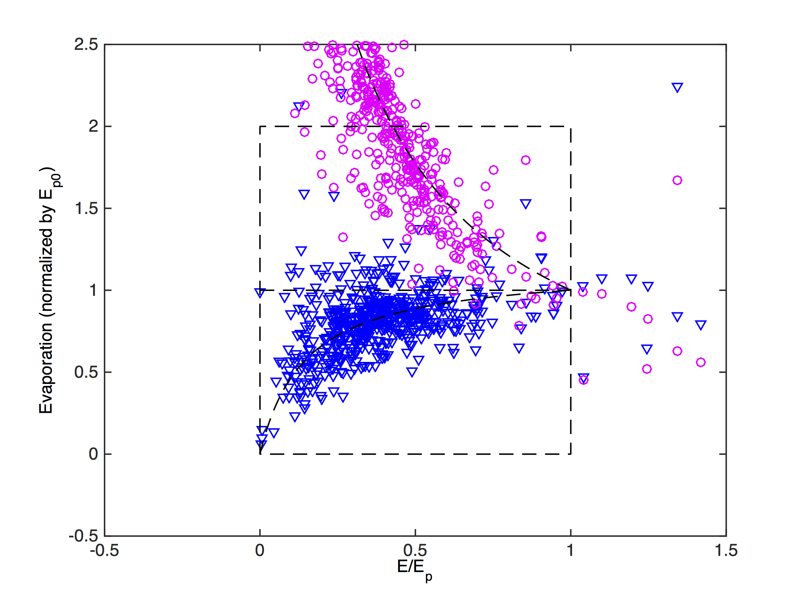

**CEES 351: Water Resources Engineering**  
**Duquesne University**  

```{r include=FALSE}
library(ggplot2)
library(raster)
library(rgdal)
library(dplyr)
library(broom)
```

## 8. Evaporation Measurement
We have already developed one method of actual evapotranspiration measurement, eddy covariance.  The other common method to measure actual evaporation is the energy balance with Bowen ratio.

Types of evaporation:  
- Evaporation: the flux of water vapor from the landscape due to the latent heat of vaporization.    
- Transpiration: the flux of water vapor from plants due to transpiration.  
- Evapotranspiration: the flux of water vapor from a vegetated landscape.  
- Potential evaporation: the evapotranspiration from a landscape of short, active vegetation with readily available moisture.  
- Pan evaporation: the evaporation from an evaporating pan.  

We usually lump evaporation and evapotranspiration together as ET.  Some studies show that transpiration can be as much as 90% of landscape ET.  

### Useful definitions (these are also in 02 Atmosphere)  
The saturation vapor pressure, $e \ast$, can be computed by a number of methods:  

\begin{multline}
\log_{10} e \ast\ = 7.90298 (\frac{T_{st}}{T} - 1) + 5.02808 \log_{10} (\frac{T_{st}}{T}) - 1.3816 \times 10^{-7}  (10^{11.344 (1 - \frac{T}{T_{st}})} - 1) + 
\\ 8.1328 \times 10^{-3} (10^{-3.19149 (\frac{T_{st}}{T} - 1)} - 1) + \log_{10} e \ast_st
\end{multline}  

where the logarithms are base 10, temperature is in Kelvin, and the steam-point temperature, $T_{st}$, is 373.16K and $e \ast_{st} = 1013.25 \mathrm{hPa}$.  Or, the nested form:

\begin{equation}
e \ast = a_0 + T ( a_1 + T ( a_2 + T ( a_3 + T (a_4 + T (a_5 + T a_6)))))
\end{equation}  

where the coefficients are given by:  

|Variable|Value|
|---|---|
|$a_0$|$6984.505294$|
|$a_1$|$-188.9039310$|
|$a_2$|$2.133357675$|
|$a_3$|$-1.288580973 \times 10^{-2}$|
|$a_4$|$4.393587233 \times 10^{-5}$|
|$a_5$|$-8.023923082 \times 10^{-8}$|
|$a_6$|$6.136820929 \times 10^{-11}$|  

The slope of the vapor pressure curve, $\Delta = \frac{d e \ast}{d T}$, is given by the empirical relationship:  

\begin{equation}
\Delta = \frac{d e \ast}{d T} = \frac{373.15 e \ast}{T^2} (13.3185-3.952 tr - 1.9335 tr^2 - 0.5196 tr^3)  
\end{equation}  

where $t_r = 1 - \frac{373.15}{T}$ and all temperatures, $T$, are in the same unit, $K$.  The psychrometric constant is given by:

\begin{equation}
\gamma = 4.9289 \times 10^{-7} T{2} + 3.4717 \times 10^{-4} T + 0.51443  
\end{equation}  

A typical value is $\gamma = 0.67 \frac{mb}{K}$ for $20^\circ C$ and standard atmosphere.  These have been measured and equations developed empirically or semi-empirically.

```{r echo=FALSE, warning=FALSE, message=FALSE}
library(readr)
library(lubridate)
library(dplyr)
library(ggplot2)
library(latex2exp)
library(devtools)
install_github("LimpopoLab/hydrostats") # NEVER do this unless you know the origin of the code.
library(hydrostats)

t <- seq(from=0, to=40, by=0.1)
delta <- sat_curve(t)
gamma <- psych(t)
coef1 <- delta/(delta+gamma)
coef2 <- gamma/(delta+gamma)
x <- data.frame(t,coef1,coef2)

ggplot(x) +
     geom_line(aes(x=t,y=coef1),color="blue") +
     geom_line(aes(x=t,y=coef2),color="green") +
     xlim(c(0,40)) +
     ylim(c(0.1,0.9)) +
     labs(x = TeX('Temperature ($^o C$)'), y = "") +
     theme(legend.position = "none") +
     theme(panel.background = element_rect(fill = "white", colour = "black")) +
     theme(aspect.ratio = 1) +
     theme(axis.text = element_text(face = "plain", size = 14), axis.title = element_text(face = "plain", size = 14)) +
     theme(legend.text = element_text(face = "plain", size = 14), legend.title = element_text(face = "plain", size = 14))
```
For use in the evaporation equations, the *blue* line is $\frac{\Delta}{\Delta+\gamma}$ and the *green* line is $\frac{\gamma}{\Delta+\gamma}$.  

### 8.1 Eddy Covariance  
As a related consequence, the turbulence profiles also allow us to estimate these fluxes by similarity.  This similarity is based on the structure of the atmospheric boundary layer.  The “Free” atmosphere is the portion of the atmosphere that is not affected by the motion of, or the activities on, the surface.  The inversion layer is the slip layer that transitions between the ABL and the free atmosphere.  Below, there are two general divisions, the outer/defect layer and the inner/surface layer.  Below the surface layer is the where the individual roughness elements play a great role.  It is in the inner/surface layer that we can apply most similarity concepts, that is, that the transfer of one fluid property occurs similarly to that of another property.  Formally, this is called Monin-Obukhov similarity, named after some of the initial discoverers.  From this, we get most turbulent similarity.  This is empirical.

\begin{equation}
E = \rho \overline{q' w'}  
\end{equation}  

### 8.2 Energy Budget with Bowen Ratio  
This method begins with a restatement of the surface energy budget and the definition of the Bowen ratio, the ratio of the sensible heat flux to the latent heat flux.  

\begin{equation}
R_{n} = G + H + L_{e}E  
\end{equation}  

\begin{equation}
\mathrm{Bo} = \frac{H}{L_{e}E}  
\end{equation}  

Which, if the Bowen Ratio can be determined (which it can, as we will show below), can be used to determine the evaporation.  First, we rearrange the surface energy balance and replace $H$ with the Bowen ratio from (6.3.2):
$R_n-G=L_eE+Bo L_eE=(1+Bo) L_eE$.  Also, it is most convenient to calculate the ground heat flux as a fraction of the net radiation (Fuchs and Hadas, 1972).  Empirically, the ground heat flux can be related to the net radiation by: $G = c_R R_n$ where $c_R$ is found by experiment.  Fuchs and Hadas found $c_R = 0.3$ for bare soil – although vegetation will decrease $c_R$.  Perrier (1975) found $c_R = 0.2$ for maize and there is good agreement for $c_R = 0.1$ for grass (Brutsaert, 1982).

\begin{equation}
(1 - c_R) Rn = (1 + \mathrm{Bo}) L_eE
\end{equation}  

\begin{equation}
E = \frac{(1 - c_R) \frac{R_n}{L_e}}{1 + \mathrm{Bo}}  
\end{equation}  

How do we measure the Bowen Ratio?  Based on similarity, we can combine the above profile equations, which depend on understanding the (transient) structure of the boundary layer every time a measurement is made, to form:  

\begin{equation}
\mathrm{Bo} = \frac{c_p (\bar{\theta_1} - \bar{\theta_2})}{L_e (\bar{q_1} - \bar{q_2})}  
\end{equation}  

This became: 

\begin{equation}
\mathrm{Bo} = \gamma \frac{(\bar{T_s} - \bar{T_a})}{L_e (\bar{e_s} - \bar{e_a})}  
\end{equation}  

where $\gamma$ is the psychrometric constant and the subscripts $s$ and $a$ refer to the surface and air measurements, respectively.  

#### 8.3 Penman Approach  
Penman (1948) assumed that $\Delta$, the slope of the saturation water vapor pressure curve with respect to temperature could then be substituted into the above formulation to yield: 

\begin{equation}
\Delta = \frac{e^{\star}_s - e^{\star}_a}{\bar{T_s} - \bar{T_a}}  
\end{equation}  

This uses the common shorthand of $Q_{ne} = \frac{R_n - G}{L_e}$.  

\begin{equation}
E = \frac{\Delta}{\Delta + \gamma} Q_{ne} + \frac{\gamma}{\Delta + \gamma} E_A  
\end{equation}  

where $E_A$ is called the drying power of the wind.  $E_A$ is an empirical relationship given below, where the result is in $mm\ day^{-1}$.  In Penman's equation, you will need to adjust the terms to match units; it is conventional to report evaporation in depth per day, so we typically adjust the first term.  

\begin{equation}
E_A = f_e (\bar{u_r})(e^{\star}_s - \bar{e_a})  
\end{equation}  

where $f_e$ is the wind function and defined for a height of $h=2m$, thus $u_2$.  Note that the vapor pressure, $e$, is in millibars ($mb$) or hectoPascals ($hPa$).  

\begin{equation}
f_e(\bar{u_2}) = 0.26 (1 + 0.54 \bar{u_2})  
\end{equation}  

If the wind speed is $u = 0$, the wind function and entire drying power of the wind go to $E_A = 0$.  This formulation is called the equilibrium evaporation.

### 8.4 Other Evaporations

Further investigation has shown potential evaporation to be a simplification of Penman's formulation.  Priestley and Taylor (1972) determined that the equilibrium evaporation could be augmented to account for the evaporation from short active vegetation with $\alpha = 1.26$.  

\begin{equation}
E = \alpha \frac{\Delta}{\Delta + \gamma} Q_{ne}  
\end{equation}  

### 8.5 Catchment Method  
Based on the water budget method, the catchment method is applicable over periods where you can assume storage to be zero; this is typically a year.  Thus, for a watershed, the evaporation can be estimated by solving:  

\begin{equation}
P-G_{out}+G_{in}+Q_{in}-Q_{out}-ET=\Delta S \approx 0
\end{equation}

The typical application is to a watershed so that, $Q_{in} = 0$, and applied over a year, typically a hydrologic year, so that there is no storage, $\Delta S  = 0$ and $G_{in} = G_{out}$.  

\begin{equation}
E = P - Q_{out}  
\end{equation}  

### 8.6 Evaporation Pan  
One of the most straightforward measurements of evaporation is the evaporation pan.  This is a pan of water and the operator measures the amount of water that evaporates from it.  Typically, measurements are made every morning.  A lysimeter is a similar apparatus but with soil and sometimes vegetation.  

### 8.7 Complementary Relationship  
Over the past 70 years, precipitation globally has increased but evaporation measured by pans has decreased.  This presented, at the turn of the century, a paradox.  Based on the development from Bouchet (1962, 1963), Brutsaert and Parlange (1998) asserted that the so-called evaporation paradox was not a paradox at all.  In fact, it was perfectly expected that in a wetter world, the evaporation measured by pans would decrease.  Consider this thought experiment, you have a wet, vegetated landscape with a pan measuring evaporation.  Now consider the actions of the pan as the vegetation goes away and the soil dries.  The pan will still evaporate; in fact, it will accelerate as there is excess energy at the surface.  

The evidence that supports this is at the catchment level with a catchment water balance and even at the daily time scale with data from EBBR.  



